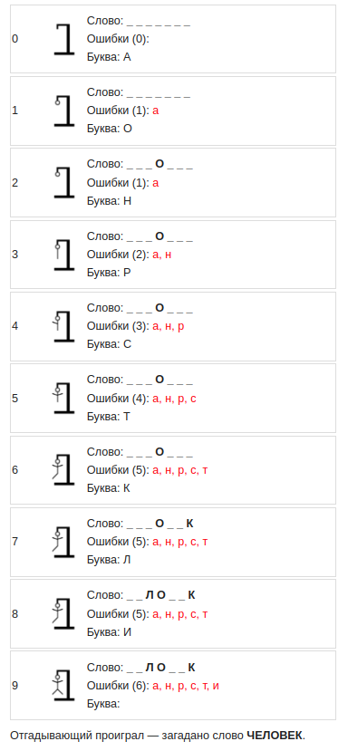

# Игра «Виселица»
### Java project
___

Интерфейс - консольный. 
Описание правил игры на [Википедии](https://ru.wikipedia.org/wiki/%D0%92%D0%B8%D1%81%D0%B5%D0%BB%D0%B8%D1%86%D0%B0_(%D0%B8%D0%B3%D1%80%D0%B0)).

Созданно в соответствии с технических заданием,
представленным в этом [курсе](https://zhukovsd.github.io/java-backend-learning-course/Projects/Hangman/).
___
## Пример игры:

